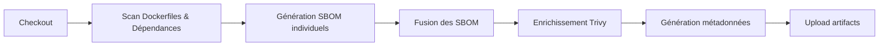

# Full Trivy Scan with CycloneDX SBOM

[](https://github.com/RomainValmo/FullTrivyScanCycloneDX/actions/workflows/test.yml)
[](https://codecov.io/gh/RomainValmo/FullTrivyScanCycloneDX)
[](https://opensource.org/licenses/MIT)
[](https://www.python.org/downloads/)
[](test/)
[](CODE_OF_CONDUCT.md)
[](CONTRIBUTING.md)
[](https://github.com/semantic-release/semantic-release)

Une GitHub Action complète pour analyser la sécurité de vos projets, générer des SBOM CycloneDX et produire des métadonnées enrichies.

## Fonctionnalités

- 🔍 **Scan automatique des Dockerfiles** : Détecte et build toutes les images Docker du projet
- 📦 **Scan des fichiers de dépendances** : Analyse requirements.txt, package.json, go.sum, etc.
- 🔗 **Fusion intelligente des SBOM** : Combine tous les SBOM en un seul sans doublons
- 📊 **Enrichissement Trivy** : Ajoute les versions corrigées et statuts de vulnérabilités
- 🏷️ **Catégorisation des composants** : Identifie les runtimes, toolchains et dépendances
- 📋 **Génération de métadonnées** : Fichier JSON détaillé pour reporting avancé
- ✅ **Conforme CycloneDX 1.6** : Format SBOM standardisé et reconnu

## Flux de travail



## Usage

### Utilisation basique

```yaml
name: Security Scan
on: [push]

jobs:
  scan:
    runs-on: ubuntu-latest
    steps:
      - uses: actions/checkout@v4
      
      - name: Full SBOM Generation
        uses: RomainValmo/FullTrivyScanCycloneDX@main
```

### Avec scan des GitHub Actions (optionnel)

```yaml
name: Security Scan with GitHub Actions
on: [push]

jobs:
  scan:
    runs-on: ubuntu-latest
    steps:
      - uses: actions/checkout@v4
      
      - name: Full SBOM Generation including workflows
        uses: RomainValmo/FullTrivyScanCycloneDX@main
        with:
          scan_github_actions: true
```

## Inputs

| Input | Description | Requis | Défaut |
|-------|-------------|--------|--------|
| `scan_github_actions` | Scan les workflows GitHub Actions et inclut les actions utilisées dans le SBOM | Non | `false` |

Quand `scan_github_actions` est activé, l'action :
- 📋 Détecte tous les fichiers workflow dans `.github/workflows/`
- 🔍 Extrait toutes les actions GitHub utilisées (format `owner/repo@version`)
- 📥 **Clone chaque repo d'action** dans un dossier temporaire
- 🔎 **Scanne les repos clonés** avec la même méthode (fichiers de lock, Dockerfiles)
- 📦 Génère des SBOM CycloneDX pour les dépendances trouvées dans les actions
- 🔗 Fusionne tous les SBOM (projet + actions) en un seul fichier final
- 🗑️ Nettoie automatiquement les repos temporaires

**Exemple** : Si votre workflow utilise `actions/checkout@v4`, l'action va :
1. Cloner https://github.com/actions/checkout (branche v4)
2. Scanner les `package.json`, `Dockerfile`, etc. du repo actions/checkout
3. Générer des SBOM pour les dépendances de cette action
4. Les inclure dans votre SBOM final

## Sorties générées

| Fichier                | Description                                           |
| ---------------------- | ----------------------------------------------------- |
| `merged-sbom.cdx.json` | SBOM CycloneDX fusionné et enrichi                    |
| `metadata.json`        | Métadonnées détaillées avec sources et vulnérabilités |

### Structure du metadata.json

```json
{
  "generated_at": "2026-01-01T12:00:00Z",
  "repository": "owner/repo",
  "branch": "main",
  "commit": "abc123...",
  "component_sources": {
    "pkg:pypi/requests@2.31.0": {
      "package_name": "requests",
      "version": "2.31.0",
      "source_file": "requirements.txt",
      "source_type": "dependency-file"
    }
  },
  "vulnerabilities": [
    {
      "vulnerability_id": "CVE-2023-xxxxx",
      "affected_packages": [
        {
          "package_name": "requests",
          "installed_version": "2.28.0",
          "fixed_version": "2.31.0",
          "fix_status": "fixed",
          "source_file": "requirements.txt"
        }
      ]
    }
  ],
  "stats": {
    "total_components": 45,
    "total_vulnerabilities": 3
  }
}
```

## Fichiers détectés automatiquement

### Dockerfiles
- `Dockerfile`
- `Dockerfile.*` (ex: `Dockerfile.dev`)
- `*.dockerfile`

### Fichiers de dépendances
- **Python** : `requirements.txt`, `Pipfile.lock`, `poetry.lock`
- **Node.js** : `package-lock.json`, `yarn.lock`, `pnpm-lock.yaml`
- **Go** : `go.sum`
- **Rust** : `Cargo.lock`
- **Java** : `pom.xml`, `build.gradle`
- **PHP** : `composer.lock`
- **Ruby** : `Gemfile.lock`

### GitHub Actions (optionnel)
- Workflows dans `.github/workflows/*.yml`
- Workflows dans `.github/workflows/*.yaml`
- Extrait les actions utilisées (`uses: owner/repo@version`)
- Les actions locales (`./...`) sont ignorées


## Architecture du projet

```
votre-repo/
├── Dockerfile              # Détecté et scanné
├── requirements.txt        # Détecté et scanné
├── package.json           # Détecté et scanné
└── app/
    └── Dockerfile.prod    # Détecté et scanné
```

Résultat généré :
```
Artifact:
├── merged-sbom.cdx.json          # SBOM fusionné
├── metadata.json                 # Métadonnées enrichies

```

## Comment ça marche ?

### Étapes d'exécution

1. **Installation de Trivy** : Installe Trivy sur le runner GitHub Actions
2. **Détection automatique** : Recherche tous les Dockerfiles et fichiers de dépendances
3. **Build des images Docker** : Construit chaque image Docker détectée avec les build-args appropriés
4. **Scan Trivy** : Génère un SBOM CycloneDX pour chaque cible (images + fichiers de dépendances + check des runtimes )
5. **Fusion** : Combine tous les SBOM en un seul fichier sans doublons
6. **Enrichissement** : Lance Trivy sur le SBOM fusionné pour ajouter les vulnérabilités et versions corrigées
7. **Métadonnées** : Génère un fichier JSON avec toutes les informations enrichies
8. **Upload** : Téléverse les résultats comme artifacts GitHub Actions

### Détection des versions runtime

L'action détecte automatiquement les versions des runtimes (Go, Python, Node.js, etc.) depuis les SBOM et les utilise pour enrichir les composants toolchain qui n'ont pas de version.

### Catégorisation des composants

Chaque composant est catégorisé selon son type :
- **dependency-file** : Dépendances externes (npm, pip, etc.)
- **docker-image** : Composants issus d'images Docker
- **go-toolchain** : Outils de compilation Go
- **application-binary** : Binaires applicatifs

## Prérequis

- GitHub Actions runner avec Ubuntu
- Docker installé (si vous scannez des Dockerfiles)
- Permissions d'écriture pour upload des artifacts

## Avancé

### Variables d'environnement utilisées

L'action utilise automatiquement ces variables GitHub Actions :
- `GITHUB_REPOSITORY` : Nom du dépôt
- `GITHUB_REF_NAME` : Nom de la branche
- `GITHUB_SHA` : Hash du commit
- `GITHUB_RUN_ID` : ID du workflow run

### Versions par défaut des runtimes

Si un Dockerfile utilise des `ARG` sans valeur par défaut, ces versions sont utilisées :
- `GO_VERSION`: 1.24
- `NODE_VERSION`: 22
- `PYTHON_VERSION`: 3.13
- `RUST_VERSION`: 1.83
- `JAVA_VERSION`: 21

## Limitations

- Profondeur de scan : 3 niveaux pour les Dockerfiles, 4 pour les fichiers de dépendances
- Les images Docker sont construites localement (nécessite de l'espace disque)
- Le SBOM fusionné peut être volumineux pour les projets complexes

## Dépannage

### Problème : Le build Docker échoue

Assurez-vous que vos Dockerfiles peuvent être buildés sans arguments externes. Utilisez des `ARG` avec des valeurs par défaut.

### Problème : Aucun SBOM généré

Vérifiez que votre projet contient au moins un Dockerfile ou un fichier de dépendances supporté.

### Problème : Metadata vide

Le fichier `metadata.json` nécessite que le SBOM fusionné contienne des composants et des vulnérabilités. Vérifiez les logs Trivy.

## Contribution

Voir [CONTRIBUTING.md](./CONTRIBUTING.md) pour les instructions de développement et contribution.

## Licence

MIT License - voir [LICENSE](./LICENSE) pour plus de détails.

## Auteur

Développé par [RomainValmo](https://github.com/RomainValmo)

## Ressources

- [Documentation Trivy](https://aquasecurity.github.io/trivy/)
- [Spécification CycloneDX](https://cyclonedx.org/)
- [GitHub Actions Documentation](https://docs.github.com/en/actions)
