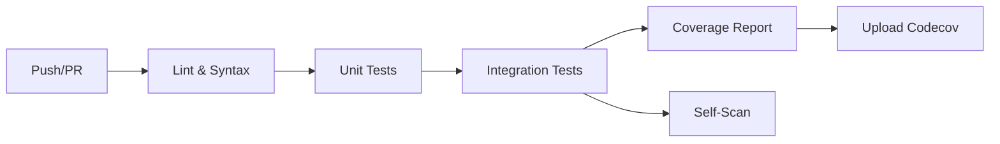

# 🧪 Batterie de tests complète ajoutée ✅

## Résumé des fichiers créés/modifiés

### Fichiers de tests (65+ tests au total)

1. **test/test_trivy_scan.py** (24 tests)
   - Tests pour `extract_build_args()` : 4 tests
   - Tests pour `find_dockerfiles()` : 8 tests
   - Tests pour `find_dependency_files()` : 8 tests
   - Tests de cas limites et gestion d'erreurs

2. **test/test_merge_sbom.py** (18 tests)
   - Tests pour `load_sbom_files()` : 4 tests
   - Tests pour `merge_sboms()` : 14 tests
   - Tests de déduplication
   - Tests de conformité CycloneDX

3. **test/test_language_mappings.py** (14 tests)
   - Tests pour `detect_runtime_versions()` : 9 tests
   - Tests pour `categorize_component()` : 5 tests
   - Tests multi-langages (Go, Python, Node.js, Java, Ruby, Rust)

4. **test/test_integration.py** (9+ tests)
   - Tests du workflow complet
   - Tests de conformité format
   - Tests de déduplication cross-source
   - Tests de performance
   - Tests de gestion d'erreurs

### Infrastructure de tests

5. **requirements-dev.txt**
   - pytest==7.4.3
   - pytest-cov==4.1.0
   - pytest-mock==3.12.0

6. **pytest.ini**
   - Configuration pytest
   - Markers pour catégoriser les tests
   - Options par défaut

7. **.coveragerc**
   - Configuration de couverture de code
   - Exclusions appropriées
   - Seuil de couverture

8. **test/conftest.py**
   - Fixtures communes réutilisables
   - `temp_dir`, `sample_dockerfile`, `sample_requirements`, `sample_sbom`

9. **test/__init__.py**
   - Package de tests

10. **test/README.md**
    - Documentation complète des tests
    - Guide d'exécution
    - Explication de la structure

### CI/CD

11. **.github/workflows/test.yml**
    - Tests automatiques sur push/PR
    - Matrix Python 3.11 et 3.12
    - Tests unitaires + intégration
    - Validation SBOM
    - Lint et vérification syntaxe
    - Upload couverture Codecov
    - Self-scan du projet

### Scripts et outils

12. **run_tests.sh**
    - Script bash pour exécuter tous les tests
    - Vérifications syntaxe + YAML
    - Rapport de couverture
    - Coloré et informatif

13. **Makefile**
    - Commandes make pour les tests
    - `make test`, `make test-unit`, `make test-cov`, etc.
    - `make lint`, `make clean`

14. **TESTING.md**
    - Guide d'installation complet
    - Options pour environnement virtuel, user, système
    - Commandes de test
    - Dépannage

### Documentation mise à jour

15. **README.md**
    - Badges ajoutés (Tests, Codecov, License, Python version)

16. **CONTRIBUTING.md**
    - Section Tests complète
    - Explication de la structure des tests
    - Commandes d'exécution
    - Objectif de couverture (>80%)

17. **.gitignore**
    - Ajout des fichiers de test
    - `.pytest_cache/`, `.coverage`, `htmlcov/`, etc.

## Structure finale

```
FullTrivyScanCycloneDX/
├── .github/
│   └── workflows/
│       └── test.yml              ← CI/CD Tests
├── test/
│   ├── __init__.py              ← Package tests
│   ├── conftest.py              ← Fixtures communes
│   ├── test_trivy_scan.py       ← Tests unitaires scan
│   ├── test_merge_sbom.py       ← Tests unitaires fusion
│   ├── test_language_mappings.py ← Tests unitaires mappings
│   ├── test_integration.py      ← Tests d'intégration
│   ├── Dockerfile               ← Dockerfile de test
│   └── README.md                ← Doc tests
├── .coveragerc                  ← Config couverture
├── pytest.ini                   ← Config pytest
├── requirements-dev.txt         ← Dépendances test
├── run_tests.sh                 ← Script exécution tests
├── Makefile                     ← Commandes make
├── TESTING.md                   ← Guide installation tests
├── README.md                    ← ✨ Badges ajoutés
├── CONTRIBUTING.md              ← ✨ Section tests ajoutée
└── .gitignore                   ← ✨ Fichiers tests exclus
```

## Comment utiliser

### Installation rapide

```bash
# Environnement virtuel (recommandé)
python3 -m venv venv
source venv/bin/activate
pip install -r requirements-dev.txt
```

### Exécution des tests

```bash
# Méthode 1 : Make (le plus simple)
make test

# Méthode 2 : Script shell
./run_tests.sh

# Méthode 3 : pytest directement
pytest test/ -v

# Avec couverture
make test-cov
```

### Avant chaque commit

```bash
make lint    # Vérifier syntaxe
make test    # Exécuter tests
```

## Résultats attendus

### Coverage
- **Objectif** : > 80% de couverture
- **Rapport HTML** : `htmlcov/index.html`
- **Upload automatique** : Codecov sur CI

### CI/CD
- ✅ Tests exécutés automatiquement sur push/PR
- ✅ Tests sur Python 3.11 et 3.12
- ✅ Validation SBOM CycloneDX
- ✅ Self-scan du projet
- ✅ Badges dans README

## Types de tests couverts

### ✅ Tests unitaires
- Extraction build args
- Détection Dockerfiles
- Détection fichiers dépendances
- Chargement SBOM
- Fusion SBOM
- Déduplication
- Détection runtimes
- Catégorisation composants

### ✅ Tests d'intégration
- Workflow complet
- Conformité CycloneDX 1.6
- Déduplication cross-source
- Format métadonnées
- Gestion d'erreurs
- Performance (gros SBOM, nombreux fichiers)

### ✅ Tests de qualité
- Syntaxe Python (PEP 8)
- Validation YAML
- Couverture de code
- Self-scan sécurité

## CI/CD Pipeline



## Badges disponibles

```markdown
[](...)
[](...)
[](...)
[](...)
```

## Prochaines étapes suggérées

1. **Première exécution locale** :
   ```bash
   python3 -m venv venv
   source venv/bin/activate
   pip install -r requirements-dev.txt
   make test
   ```

2. **Push sur GitHub** pour déclencher la CI

3. **Configurer Codecov** (optionnel) :
   - Créer un compte sur codecov.io
   - Ajouter le token dans les secrets GitHub

4. **Améliorer la couverture** si < 80%

## Support

- Tests : [test/README.md](test/README.md)
- Installation : [TESTING.md](TESTING.md)
- Contribution : [CONTRIBUTING.md](CONTRIBUTING.md)

---

**Status** : ✅ Batterie de tests complète et prête à l'emploi !
